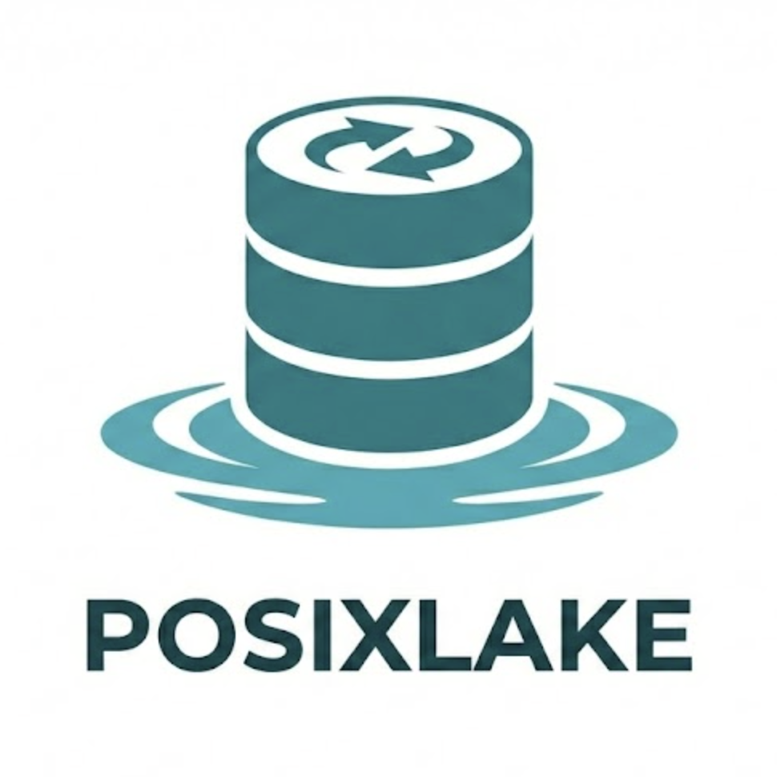

<div align="center">
  
  <h1>posixlake</h1>
  <p><strong>Posix and ACID compliant directory based database built with Rust</strong></p>
  
  <p><em>A columnar database engine where UNIX tools (cat, grep, awk, wc, head, tail, sort, cut, echo >>, sed -i, vim, mkdir, mv, cp, rmdir, rm) trigger Delta Lake operations including MERGE (UPSERT), ACID transactions, and native format storage. Works with local filesystem directories and object storage/S3. Built on Apache Arrow, Parquet, and DataFusion for high-performance analytics workloads.</em></p>

[](https://www.rust-lang.org)
[](https://delta.io)
[](LICENSE.md)
[](bindings/python/)

[](https://arrow.apache.org)
[](https://parquet.apache.org)
[](https://datafusion.apache.org)
[](.)
[](.)
</div>

---

## What is posixlake?

posixlake is a **file-system database** where **POSIX commands trigger Delta Lake operations**. Works with **local filesystem directories** (`/path/to/database`) and **object storage/S3** (`s3://bucket/path`) - same unified API for both. Mount it as a filesystem via NFS and use `cat`, `grep`, `awk`, `sed` directly on your data. CSV overwrites (`sed -i`, vim edits) trigger **MERGE (UPSERT)** with atomic INSERT/UPDATE/DELETE. Under the hood, everything is stored in **native Delta Lake format** for full compatibility with Spark, Databricks, and Athena.

### Mount as Filesystem - Query with UNIX Tools

When you mount a Delta Lake database via posixlake's NFS server, it exposes this filesystem structure:

```
/mnt/data/              (mount point)
├── data/               (directory containing data views)
│   ├── data.csv        (CSV view of all Parquet data - generated on-demand)
│   ├── data.json       (JSON view of all data)
│   ├── data.jsonl      (JSON Lines view)
│   └── *.parquet       (direct access to underlying Parquet files)
├── schema.sql          (table schema as SQL CREATE TABLE)
└── .query              (write SQL queries here to execute them)
```

**Key Concept: CSV Facade**

`/data/data.csv` is a **live view** of your Delta Lake table:
- Dynamically generated from Parquet data on read (works with local filesystem and S3-backed tables)
- All columns visible as CSV format
- Writes to this file trigger Delta Lake ACID transactions
- Changes are immediately persisted to Parquet files (local or S3)

**How It Works Technically:**

**Read Operations (cat, grep, awk, wc):**
1. User runs `cat /mnt/data/data/data.csv` or `grep "pattern" /mnt/data/data/data.csv`
2. OS NFS client sends READ request to posixlake NFS server (with offset + size)
3. Server checks **two-tier cache** (memory → disk)
4. **Cache miss**: Query all Parquet files → Convert RecordBatch to CSV → Cache full content
5. **Cache hit**: Return requested byte range (microsecond from memory, millisecond from disk)
6. For **large files (≥1MB)**: Cached content uses memory-mapped I/O for zero-copy access
7. **grep behavior**: First read generates full CSV and caches it. Subsequent reads (as grep scans) hit cache and return only requested ranges
8. Result: After initial caching, `grep` on large files is fast (no regeneration, only cache reads)

**Write Operations (echo >>, sed -i):**

**Append (echo >>):**
1. User runs `echo "1,Alice,30" >> /mnt/data/data/data.csv`
2. OS NFS client sends WRITE request with CSV bytes
3. Server parses CSV using Arrow CSV reader → RecordBatch
4. `DatabaseOps::insert(batch)` triggers **Delta Lake ACID transaction**
5. Transaction commits to `_delta_log/*.json` with new Parquet file
6. Cache invalidated (next read regenerates CSV with new data)
7. Result: POSIX append becomes Delta Lake transaction with full ACID guarantees

**Overwrite (sed -i, vim, cat > file):**
1. User overwrites CSV: `sed -i 's/Alice/ALICE/' data.csv` or `cat modified.csv > data.csv`
2. Server compares old CSV (from cache) vs new CSV (from write)
3. Detects changes using ID column (or first Int32/Int64 column):
   - **New IDs** → INSERT operations
   - **Modified rows** (same ID, different data) → UPDATE operations  
   - **Missing IDs** (in old, not in new) → DELETE operations
4. Executes **MERGE (UPSERT)** via `DatabaseOps::merge()` in **single atomic transaction**
5. MERGE applies all INSERT/UPDATE/DELETE operations atomically to Delta Lake
6. Transaction commits to `_delta_log/*.json` (updates as INSERT+DELETE, deletes use deletion vectors)
7. Cache invalidated (next read shows all changes)
8. Result: CSV overwrite becomes atomic MERGE with INSERT/UPDATE/DELETE in one transaction

**Delete Operations (via POSIX):**
- **File deletion** (`rm /mnt/data/data/data.csv`): **Supported** - Truncates table (deletes all rows)
  - Uses `DatabaseOps::delete_rows_where("1=1")` with Delta Lake deletion vectors
  - Efficient: marks all rows as deleted without rewriting Parquet files
  - Run OPTIMIZE later to permanently remove deleted rows and reclaim space
- **Row-level operations** (INSERT/UPDATE/DELETE via CSV overwrite): **Powered by MERGE**
  - Overwrite CSV with modified content: `grep -v "Alice" data.csv > temp && cat temp > data.csv`
  - Or: `sed -i '/Alice/d' data.csv` (deletes), `sed -i 's/Alice/ALICE/' data.csv` (updates)
  - Or: Edit with vim/nano and save
  - Server detects all changes by comparing old vs new CSV using ID column
  - Executes **MERGE (UPSERT)** in single atomic Delta Lake transaction:
    - New rows → INSERT
    - Modified rows → UPDATE (implemented as DELETE + INSERT)
    - Missing rows → DELETE (using deletion vectors)
  - All operations applied atomically - either all succeed or all fail
  - Efficient: deletion vectors avoid Parquet rewrites, OPTIMIZE later reclaims space
  - **Stress tested**: 30M rows (1GB CSV) - see [STRESS_TEST_RESULTS.md](STRESS_TEST_RESULTS.md)
  
**Example workflow:**
```bash
# Read current data
cat data.csv > old.csv

# Make changes (delete Alice, update Bob's age, add Charlie)
grep -v "Alice" old.csv > temp.csv
sed -i 's/Bob,30/Bob,31/' temp.csv
echo "3,Charlie,28" >> temp.csv

# Overwrite triggers MERGE: 1 DELETE + 1 UPDATE + 1 INSERT in single transaction
cat temp.csv > data.csv
```

**Additional Delete Methods (SQL API):**
- **Programmatic deletion**: `db.delete_rows_where("id = 5")` for direct API access
- **Deletion vectors**: Uses Delta Lake's deletion vectors (efficient, no Parquet rewrite)
- **OPTIMIZE** later compacts files and removes deleted rows permanently

**Performance for Large Tables:**
- **Two-tier cache**: Memory (moka, microsecond) + Disk (sled, millisecond) for generated CSV
- **Memory-mapped I/O**: Cached files ≥1MB use `mmap` for zero-copy reads
- **grep optimization**: First read caches full CSV, subsequent reads (as grep scans) hit cache with byte-range requests
- **Trade-off**: Initial read generates full CSV (expensive), but all subsequent operations are cache-only (fast)
- **LRU eviction**: Max 100 mmapped files, automatic eviction of least recently used
- **Cache promotion**: Disk cache hits promoted to memory cache
- **Cache invalidation**: Writes invalidate cache, next read regenerates CSV with updated data

**Use standard POSIX commands on your database:**

```bash
# Mount database as filesystem
posixlake mount /path/to/database /mnt/data

# data.csv is a CSV view of the Parquet data
cat /mnt/data/data/data.csv
# id,name,age,city
# 1,Alice,30,NYC
# 2,Bob,25,SF
# 3,Charlie,35,LA

# Grep for specific records
grep "Alice" /mnt/data/data/data.csv
# 1,Alice,30,NYC

# Stream processing with awk
awk -F',' '{print $2}' /mnt/data/data/data.csv | sort
# Alice
# Bob
# Charlie

# Append new data (writes to Delta Lake!)
echo "4,Dave,28,Boston" >> /mnt/data/data/data.csv

# Edit data with any tool - triggers MERGE (UPSERT) under the hood
sed -i 's/Alice,30/Alice,31/' /mnt/data/data/data.csv  # UPDATE
grep -v "Bob" /mnt/data/data/data.csv > temp && cat temp > /mnt/data/data/data.csv  # DELETE
# All changes applied as atomic Delta Lake MERGE transaction (INSERT/UPDATE/DELETE)

# Verify changes persisted
wc -l /mnt/data/data/data.csv
# 4 /mnt/data/data/data.csv (Bob deleted, Alice updated, Dave inserted)
```

**How it works:**
- Pure Rust NFS server (no FUSE, no kernel modules)
- OS built-in NFS client (zero installation)
- All writes go through Delta Lake ACID transactions
- Read Parquet files as CSV automatically

**Works with S3 too!** Mount cloud Delta tables as POSIX filesystem:

```bash
# Mount S3-backed Delta table
posixlake mount s3://my-bucket/delta-table /mnt/s3-data

# Now use UNIX tools on cloud data!
grep "pattern" /mnt/s3-data/data/data.csv
cat /mnt/s3-data/data/data.csv | awk -F',' '{sum+=$3} END {print sum}'

# Writes go to S3 with Delta Lake ACID transactions
echo "new,record,123" >> /mnt/s3-data/data/data.csv
```

### Delta Lake Native Format

**Every posixlake database IS a Delta Lake table:**

```bash
# Create database via posixlake
posixlake create /path/to/database

# Data is immediately readable by Spark/Databricks/Athena
# -> Native _delta_log/ transaction log
# -> Standard Parquet data files
# -> No export or translation needed
```

**posixlake vs Traditional Delta Lake:**

| Feature | posixlake | Traditional Delta Lake |
|---------|------|----------------------|
| Format | Native Delta Lake | Delta Lake |
| ACID Transactions | Delta Lake protocol | Delta Lake protocol |
| S3/Cloud Storage | ✓ Native support | Native support |
| Storage Abstraction | ✓ Unified Local/S3/NFS | ObjectStore only |
| POSIX Interface | ✓ Pure Rust NFS server (works with S3!) | ✗ Not available |
| SQL Queries | ✓ DataFusion (embedded) | Spark/Presto (separate) |
| Mount as Filesystem | ✓ `mount /mnt/posixlake` (local or S3) | ✗ Not available |
| UNIX Tools | ✓ `cat`, `grep`, `awk` on local and S3 | ✗ Requires Spark/export |
| Ecosystem | Full Delta Lake compatibility | Full ecosystem |
| Deployment | ✓ Single binary | Requires Spark cluster |

**Why posixlake:**

- **POSIX Commands Work**: Use `cat`, `grep`, `awk`, `sed`, `echo >>` directly on your database
- **No Special Tools**: Mount via NFS, use standard UNIX commands - that's it
- **Delta Lake Native**: Every database IS a Delta Lake table - readable by Spark/Databricks/Athena immediately
- **ACID Transactions**: All POSIX writes go through proper ACID transactions
- **Pure Rust NFS Server**: Zero dependencies - no FUSE, no kernel modules, works everywhere
- **Unified Storage Abstraction**: NFS server works with **both local and S3 backends** - mount S3 Delta tables as POSIX filesystem!
- **S3 Backend**: Store Delta Lake tables on S3/MinIO with transparent local caching - use `grep` on S3 data!
- **SQL Support**: Full SQL via DataFusion when you need it
- **Fast**: Columnar Parquet with Snappy compression, query pruning, memory-mapped I/O

**Core Features:**

- **Query with UNIX Tools**: `cat`, `grep`, `awk`, `wc`, `head`, `tail`, `sort`, `cut` all work on mounted database
- **Write with Standard Commands**: `echo >>`, `sed -i`, `vim`, `cat >` - all writes persist to Delta Lake via ACID transactions
- **File Operations**: `mkdir`, `mv`, `cp`, `rmdir`, `rm`, `stat` - full file/directory management
- **MERGE (UPSERT) Operations**: INSERT, UPDATE, DELETE in single atomic Delta Lake transaction
- **Pure Rust NFS Server**: Zero external dependencies - OS has NFS client built-in
- **Delta Lake Format**: Native `_delta_log/` transaction logs - Spark/Databricks/Athena compatible
- **ACID Everywhere**: Even `echo >>` goes through proper transactions with conflict detection
- **Storage Abstraction Layer**: Unified backend for Local/S3/NFS - same API, any storage
- **S3 + NFS Integration**: Mount S3-backed Delta tables as POSIX filesystem - `grep` works on cloud data!
- **Schema Evolution**: Add columns dynamically - old data gets NULL automatically
- **Note**: Metadata operations (`touch`, `chmod`, `chown`) are silently ignored as timestamps/permissions reflect Delta Lake commits and database-layer RBAC. Symlinks (`ln -s`) return NFS3ERR_NOTSUPP - use SQL views instead.

## Architecture

### System Overview

```
┌────────────────────────────────────────────────────────┐
│  POSIX Commands: cat, grep, awk, sed, wc, echo >>      │
│  User: mount /mnt/data → cat /mnt/data/data/data.csv   │
└─────────────────────┬──────────────────────────────────┘
                      │
┌─────────────────────▼──────────────────────────────────┐
│  Pure Rust NFS Server (NFSv3, port 12049)              │
│  ┌──────────────────────────────────────────────┐      │
│  │ Filesystem Structure:                        │      │
│  │   /data/data.csv    (CSV facade)             │      │
│  │   /data/data.json   (JSON view)              │      │
│  │   /data/*.parquet   (raw Parquet files)      │      │
│  │   /schema.sql       (schema definition)      │      │
│  │   /.query           (SQL interface)          │      │
│  └──────────────────────────────────────────────┘      │
│  • Reads: Query Parquet → generate CSV on-demand       │
│  • Writes: Parse CSV → Delta Lake transaction          │
└─────────────────────┬──────────────────────────────────┘
                      │
┌─────────────────────▼──────────────────────────────────┐
│  posixlake Core (DatabaseOps)                               │
│  • insert() / query() / delete_rows_where()            │
│  • DataFusion SQL engine                               │
│  • Storage abstraction (Local/S3)                      │
└─────────────────────┬──────────────────────────────────┘
                      │
┌─────────────────────▼──────────────────────────────────┐
│  Delta Lake Protocol (deltalake-rs)                    │
│  • ACID transactions via _delta_log/*.json             │
│  • Snapshot isolation & time travel                    │
│  • Deletion vectors for row-level deletes              │
│  • Checkpointing & protocol versioning                 │
└─────────────────────────┬──────────────────────────────┘
                          │
        ┌─────────────────┴─────────────────┐
        │                                   │
        ▼                                   ▼
    ┌─────────────┐                 ┌──────────────┐
    │   Local     │                 │  S3/MinIO    │
    │ Filesystem  │                 │ Object Store │
    │ _delta_log/ │                 │ _delta_log/  │
    │ *.parquet   │                 │ *.parquet    │
    └─────────────┘                 └──────────────┘
```

**Key Components:**

- **NFS Server**: Pure Rust NFSv3 server for POSIX interface (works with **any** storage backend)
- **DatabaseOps**: High-level CRUD and SQL operations
- **Delta Lake**: Native Delta Lake format for ACID transactions
- **Storage Abstraction**: Unified `ObjectStore` backend - Local filesystem or S3/MinIO
- **Key Innovation**: NFS + S3 = mount cloud Delta tables as POSIX filesystem with `cat`, `grep`, `awk`!

### Data Directory Structure (Delta Lake Native Format)

```
/path/to/database/
├── _delta_log/                              # Delta Lake Transaction Log
│   ├── 00000000000000000000.json           # Version 0: CREATE TABLE (metadata + protocol)
│   ├── 00000000000000000001.json           # Version 1: INSERT (add actions)
│   ├── 00000000000000000002.json           # Version 2: INSERT (add actions)
│   └── 00000000000000000010.checkpoint.parquet  # Checkpoint (every 10 commits)
│
├── part-00000-{uuid}-c000.snappy.parquet   # Delta Lake Parquet data files
├── part-00001-{uuid}-c000.snappy.parquet   # (Standard Delta Lake naming)
└── part-00002-{uuid}-c000.snappy.parquet

# 100% Delta Lake compatible!
# - Apache Spark can read this directory directly
# - Databricks can query without any conversion
# - AWS Athena can access as Delta table
# - All Delta Lake ecosystem tools work immediately
```

## Quick Start

### Installation

#### Rust Library

```bash
# Build from source
git clone https://github.com/npiesco/posixlake.git
cd posixlake
cargo build --release

# Binary is at target/release/posixlake
```

**Prerequisites:** Rust 1.70+, NFS client (built-in on macOS/Linux/Windows Pro)

#### Python Bindings

```bash
# Install from PyPI (recommended - requires Python 3.11+)
pip install posixlake-py

# Or build from source (supports Python 3.8+)
cd posixlake
cargo build --release
cargo run --bin uniffi-bindgen -- generate \
    --library target/release/libposixlake.dylib \
    --language python \
    --out-dir ../bindings/python/posixlake
cp target/release/libposixlake.dylib ../bindings/python/posixlake/
pip install -e ../bindings/python/
```

**Requirements:**
- **Python 3.11+** for prebuilt wheels with native library
- Python 3.8+ for building from source

**PyPI Package:** https://pypi.org/project/posixlake-py/

**Python Quick Start:**

```python
from posixlake import DatabaseOps, Schema, Field, NfsServer

# Create database
schema = Schema(fields=[
    Field(name="id", data_type="Int32", nullable=False),
    Field(name="name", data_type="String", nullable=False),
])
db = DatabaseOps.create("/path/to/db", schema)

# Insert data (regular)
db.insert_json('[{"id": 1, "name": "Alice"}]')

# Buffered insert for high performance (10x faster for small batches)
for i in range(100):
    db.insert_buffered_json(f'[{{"id": {i}, "name": "User_{i}"}}]')
db.flush_write_buffer()  # Commit all buffered data

# Query with SQL
results = db.query_json("SELECT * FROM data WHERE id > 0")
print(results)

# Mount as filesystem and use POSIX tools
nfs = NfsServer(db, 12049)
# sudo mount_nfs -o nolocks,vers=3,tcp,port=12049,mountport=12049 localhost:/ /mnt/posixlake
# cat /mnt/posixlake/data/data.csv | grep "Alice" | awk -F',' '{print $2}'
```

See [Python Bindings Documentation](bindings/python/README.md) for complete API reference.

### Usage - POSIX Interface

The easiest way to use posixlake is to mount it as a filesystem:

```bash
# Create and mount a database
./target/release/posixlake mount /path/to/database /mnt/data

# Now use regular UNIX commands!
cat /mnt/data/data/data.csv        # Read all data
grep "pattern" /mnt/data/data/*.csv # Search
awk -F',' '{print $2}' /mnt/data/data/data.csv  # Process
echo "id,name,value" >> /mnt/data/data/data.csv  # Append

# Unmount when done
./target/release/posixlake unmount /mnt/data
```

All writes persist to Delta Lake with full ACID guarantees. No special tools needed - just standard UNIX commands.

#### Setup MinIO (Optional - for S3 backend)

```bash
# Start MinIO using Docker Compose
docker compose up -d

# Verify MinIO is running
curl http://localhost:9000/minio/health/live
# Expected: 200 OK

# MinIO Console (web UI)
open http://localhost:9001
# Login: minioadmin / minioadmin

# Test S3 backend
./target/release/posixlake s3-test "s3://posixlake-test/test_db"
```

**MinIO Configuration:**

The project includes `.cargo/config.toml` with default MinIO settings:

```toml
[env]
MINIO_ENDPOINT = "http://localhost:9000"
MINIO_ACCESS_KEY = "minioadmin"
MINIO_SECRET_KEY = "minioadmin"
MINIO_BUCKET = "posixlake-test"
```

**Custom S3 Configuration:**

To use AWS S3 or custom MinIO:

```bash
# Export environment variables
export MINIO_ENDPOINT="https://s3.amazonaws.com"
export MINIO_ACCESS_KEY="your-access-key"
export MINIO_SECRET_KEY="your-secret-key"
export MINIO_BUCKET="your-bucket"

# Or pass via CLI
./target/release/posixlake s3-test "s3://your-bucket/your-db" \
  --endpoint "https://s3.amazonaws.com" \
  --access-key "your-access-key" \
  --secret-key "your-secret-key"
```

### Basic Usage

#### Rust API

```rust
use posixlake::{Database, Record};
use std::collections::HashMap;

fn main() -> posixlake::Result<()> {
    // Create a new database
    let db = Database::create("/path/to/database")?;
    
    // Insert data
    let mut record = HashMap::new();
    record.insert("name".to_string(), "Alice".to_string());
    record.insert("age".to_string(), "30".to_string());
    record.insert("email".to_string(), "alice@example.com".to_string());
    
    let id = db.insert(Record { data: record })?;
    println!("Inserted record with ID: {}", id);
    
    // Query data
    let result = db.get(&id)?;
    println!("Retrieved: {:?}", result);
    
    Ok(())
}
```

#### SQL Queries (DataFusion Integration)

```rust
use posixlake::query::PosixLakeTableProvider;
use datafusion::prelude::*;
use arrow::array::{Int32Array, StringArray, RecordBatch};
use arrow::datatypes::{DataType, Field, Schema};
use std::sync::Arc;

#[tokio::main]
async fn main() -> posixlake::Result<()> {
    // Create schema
    let schema = Arc::new(Schema::new(vec![
        Field::new("id", DataType::Int32, false),
        Field::new("name", DataType::Utf8, false),
        Field::new("email", DataType::Utf8, false),
    ]));
    
    // Create sample data
    let batch = RecordBatch::try_new(
        schema.clone(),
        vec![
            Arc::new(Int32Array::from(vec![1, 2, 3])),
            Arc::new(StringArray::from(vec!["Alice", "Bob", "Charlie"])),
            Arc::new(StringArray::from(vec![
                "alice@example.com",
                "bob@example.com",
                "charlie@example.com"
            ])),
        ],
    )?;
    
    // Register table provider
    let provider = PosixLakeTableProvider::new(schema, vec![batch])?;
    let ctx = SessionContext::new();
    ctx.register_table("users", Arc::new(provider))?;
    
    // Execute SQL queries
    let df = ctx.sql("SELECT name, email FROM users WHERE id > 1").await?;
    let results = df.collect().await?;
    
    println!("Query results: {:?}", results);
    
    Ok(())
}
```

#### Transaction Example

```rust
use posixlake::transaction::{TransactionManager, TransactionVisibility, FileVersion};

fn main() -> posixlake::Result<()> {
    // Initialize transaction manager
    let txn_manager = TransactionManager::new();
    
    // Begin transaction
    let mut txn = txn_manager.begin_transaction()?;
    println!("Started transaction: {}", txn.id);
    
    // Simulate file operations
    let file = FileVersion {
        path: "data/users_001.parquet".to_string(),
        created_by_txn_id: txn.id,
        created_at_ts: txn.snapshot.timestamp,
        created_committed: false,
        deleted_by_txn_id: None,
        deleted_at_ts: None,
        deleted_committed: None,
    };
    
    // Check visibility (read-your-own-writes)
    let visible = TransactionVisibility::is_visible(&txn.snapshot, &file);
    println!("File visible to transaction: {}", visible);
    
    // Commit transaction
    txn.commit()?;
    println!("Transaction committed");
    
    Ok(())
}
```


**How S3 Storage Works:**

posixlake uses **Delta Lake native format** with full S3 support:

- **Delta Lake Format**: Native `_delta_log/` transaction log in S3
- **S3-First Architecture**: All data and metadata stored in S3
- **Local Cache**: Transparent local caching for performance
- **Full ACID**: Delta Lake provides transaction guarantees
- **Ecosystem Compatible**: Tables readable by Spark/Databricks/Athena
- **MinIO Compatible**: Works with S3-compatible object stores

**Storage Distribution:**

| Component | Location | Reason |
|-----------|----------|--------|
| Delta Transaction Log (`_delta_log/`) | **S3 + Local cache** | Delta Lake standard, ACID guarantees |
| Parquet Files | **S3 + Local cache** | Large, immutable, columnar data |
| Local Cache | Local filesystem | Performance optimization |

**Verification:**

After creating a database with S3 backend, you can verify files are in MinIO:

```bash
# List databases
docker compose exec minio sh -c "mc alias set myminio http://localhost:9000 minioadmin minioadmin && mc ls myminio/posixlake-test/"

# Inspect Delta Lake transaction log
docker compose exec minio sh -c "mc ls myminio/posixlake-test/your_db/_delta_log/"
# → 00000000000000000000.json (Delta Lake transaction log)
# → 00000000000000000001.json (subsequent transactions)

# Inspect Parquet data files
docker compose exec minio sh -c "mc ls myminio/posixlake-test/your_db/"
# → part-00000-*.snappy.parquet (Delta Lake Parquet files)

# Read Delta transaction log
docker compose exec minio sh -c "mc cat myminio/posixlake-test/your_db/_delta_log/00000000000000000000.json"
# → Delta Lake metadata, protocol, and add actions
```

**Environment Configuration:**

```toml
# .cargo/config.toml
[env]
MINIO_ENDPOINT = "http://localhost:9000"
MINIO_ACCESS_KEY = "minioadmin"
MINIO_SECRET_KEY = "minioadmin"
MINIO_BUCKET = "posixlake-test"
```


## Tech Stack

**Core Libraries:**

- **Arrow** 56.2 - Columnar in-memory format
- **Parquet** 56.2 - Columnar file format
- **DataFusion** 50.3 - SQL query engine
- **DeltaLake** 0.29 - Table storage framework
- **Tokio** 1.48 - Async runtime
- **ObjectStore** 0.12 - Storage abstraction
- **Moka** 0.12 - High-performance in-memory cache (LRU/TTL)
- **Sled** 0.34 - Embedded database for persistent disk cache
- **Memmap2** 0.9 - Memory-mapped file I/O for zero-copy reads
- **Serde** 1.0 - JSON serialization
- **Bincode** 2.0 - Binary serialization for WAL
- **CRC** 3.3 - CRC32 checksums
- **NFSServe** - Pure Rust NFSv3 server implementation

**Development:**

- **TempFile** 3.23 - Temporary directories for tests
- **Tracing** - Structured logging
- **Thiserror** - Error handling


```bash
# Run all tests
cargo test

# S3 integration tests (requires MinIO)
docker compose up -d
cargo test s3_test

# Python bindings test
python3 posixlake/examples/python_example.py

# Delta Lake interoperability test (requires PySpark)
python3 posixlake/examples/interop_test_spark_posixlake.py

# Cleanup
docker compose down
```

**Test Suites:**
- Full Delta Lake operations (Time Travel, OPTIMIZE, VACUUM, Z-ORDER, Data Skipping)
- S3/MinIO backend tests
- NFS server and POSIX interface tests
- Security and RBAC tests
- Python bindings (complete working example with NFS)
- **Delta Lake Interoperability Test**: PySpark ↔ posixlake (100% compatible)

For detailed testing documentation, see [tests/POSIX_TEST_SETUP.md](tests/POSIX_TEST_SETUP.md).

## Features

### Delta Lake Integration

- Native Delta Lake `_delta_log/` transaction log format
- Full compatibility with Spark, Databricks, and AWS Athena
- No translation or export required
- Standard Delta Lake Parquet file naming

### Storage & Performance

- Columnar Parquet storage with Snappy compression
- S3 and MinIO native support
- Two-tier caching system (memory + disk)
- Memory-mapped I/O for large files
- Lazy loading and write buffering

### Transaction & Concurrency

- Delta Lake snapshot isolation
- Read-your-own-writes semantics
- Write-write conflict detection
- ACID guarantees via Delta Lake protocol
- Automatic schema evolution with NULL padding

### Query Engine

- Full SQL support via DataFusion
- **MERGE (UPSERT)** operations - INSERT/UPDATE/DELETE in single transaction
- Column statistics for query pruning
- Predicate pushdown optimization
- Deletion vectors for efficient row-level deletes
- Complex type support (Struct, List, Map, Decimal, Timestamp)

### POSIX Interface

- Pure Rust NFS server (zero dependencies)
- Mount database as filesystem
- Use standard UNIX tools (`cat`, `grep`, `awk`, `sed`, `vim`)
- Cross-platform (Linux, macOS, Windows)
- CSV views of all Parquet data

### Advanced Features

- User authentication with bcrypt
- Role-based access control (RBAC)
- Audit logging for compliance
- Backup and restore with point-in-time recovery
- Monitoring and health check APIs

### Python Bindings

- **UniFFI-generated** bindings for Python 3.8+ (3.11+ recommended for PyPI wheels)
- **Full API Coverage**: All core features accessible from Python including MERGE
- **NFS Server Support**: Mount Delta Lake as filesystem from Python
- **Type Safety**: Complete type hints and error handling
- **Zero-Copy Operations**: Efficient Rust-Python interop
- **Robust**: Comprehensive error handling and async support
- **PyPI Available**: `pip install posixlake-py` (Python 3.11+ for prebuilt wheels)

Example MERGE (UPSERT) operation:
```python
from posixlake import DatabaseOps
import json

db = DatabaseOps.open("my_delta_table")
merge_data = [
    {"id": 1, "name": "Alice", "age": 31, "_op": "UPDATE"},
    {"id": 2, "name": "Bob", "age": 35, "_op": "DELETE"},
    {"id": 3, "name": "Charlie", "age": 28, "_op": "INSERT"}
]
result = db.merge_json(json.dumps(merge_data), "id")
metrics = json.loads(result)  # {"rows_inserted": 1, "rows_updated": 1, "rows_deleted": 1}
```

See [bindings/python/](bindings/python/) for documentation and [PYTHON_BINDINGS_COMPLETE.md](bindings/python/PYTHON_BINDINGS_COMPLETE.md) for implementation details.

## Performance

posixlake is designed for high-performance analytics workloads:

- **Write latency**: 5-50ms (Parquet encoding + Delta Lake commit)
- **Read latency**: 1-10ms (Parquet decompression with column pruning)
- **Write throughput**: 1K-10K rows/sec
- **Read throughput**: 10K-100K rows/sec
- **Memory overhead**: ~1MB for 100 active files
- **Row deletion**: 46ms for 10 rows (100-row table), 152ms for 100 rows (10K-row table)
- **Stress tested**: 30M rows (1GB CSV) with successful deletion - see [STRESS_TEST_RESULTS.md](STRESS_TEST_RESULTS.md)

### Running Stress Tests

The stress test suite is ignored by default due to long runtimes (~30 minutes). To run:

```bash
# Run the 1GB CSV stress test
cargo test test_1gb_csv_stress -- --ignored --nocapture

# Run all tests including stress tests
cargo test -- --ignored --nocapture
```

See [STRESS_TEST_RESULTS.md](STRESS_TEST_RESULTS.md) for detailed performance benchmarks on extreme-scale datasets.

## License

**Apache License 2.0**

Copyright 2025 posixlake Contributors

Licensed under the Apache License, Version 2.0 (the "License");
you may not use this file except in compliance with the License.
You may obtain a copy of the License at

    http://www.apache.org/licenses/LICENSE-2.0

Unless required by applicable law or agreed to in writing, software
distributed under the License is distributed on an "AS IS" BASIS,
WITHOUT WARRANTIES OR CONDITIONS OF ANY KIND, either express or implied.
See the License for the specific language governing permissions and
limitations under the License.

**Why Apache 2.0?** posixlake builds on Delta Lake (Apache 2.0) and follows Linux Foundation standards for open infrastructure software. This permissive license enables broad adoption while protecting contributors through patent grants.

See [LICENSE.md](LICENSE.md) for the full license text.

## Contributing

Contributions welcome! Please follow these guidelines:

1. **Write tests first** - TDD approach for all features
2. **Run full suite** - Ensure `cargo test` passes
3. **Update documentation** - Keep README and docs up to date
4. **Commit messages** - Use conventional commits (e.g., `feat: Add conflict detection`)

## Acknowledgments

Built with:

- [Rust](https://www.rust-lang.org/) - Systems programming language
- [Apache Arrow](https://arrow.apache.org/) - Columnar in-memory format
- [Apache Parquet](https://parquet.apache.org/) - Columnar file format
- [DataFusion](https://datafusion.apache.org/) - Query engine
- [Delta Lake](https://delta.io/) - Transaction log
- [ObjectStore](https://docs.rs/object_store/) - Storage abstraction

Inspired by:

- [DuckDB](https://duckdb.org/) - Columnar analytics
- [SQLite](https://sqlite.org/) - File-based database

---

**Questions?** Open an [issue](https://github.com/npiesco/posixlake/issues)

**Like this project?** Star the repo and share with your data engineering team!